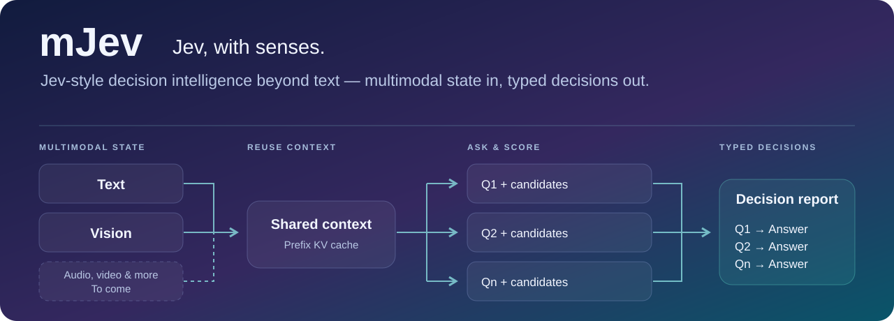
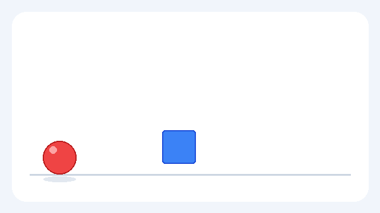

<p align="center">
  
</p>

<h1 align="center">mJev</h1>
<p align="center"><strong>简体中文</strong> · <a href="README.md">English</a></p>
<p align="center"><strong>Jev, with senses.</strong></p>
<p align="center">
  <a href="docs/index.zh-CN.md">项目介绍</a> ·
  <a href="#quick-start">快速开始</a> ·
  <a href="docs/hf.zh-CN.md">部署教程</a> ·
  <a href="docs/development.zh-CN.md">开发者文档</a> ·
  <a href="docs/validation_current.zh-CN.md">最新验证</a> ·
  <a href="CONTRIBUTING.zh-CN.md">参与贡献</a>
</p>
<p align="center">
  <a href="LICENSE"></a>
  
  
</p>

## 超越文本的决策智能

**Jev-style decision intelligence beyond text — multimodal state in, typed decisions out.**

Text and vision today. Audio, video, and more to come.

mJev 将共享上下文转化为明确的选择：输入上下文，提出多个问题，并为每个问题定义候选项。每个结果包含最终选择、候选概率和原始 logits，便于检查决策并接入后续流程。当前聚焦文本与视觉，未来扩展到音频、视频及更多模态。

- **共享上下文**：跨问题复用前缀 KV，支持问题批处理。
- **明确输出**：每道题拥有自己的候选集合，让每个决策对应一个预先定义的选项。
- **可运行流程**：在 HF／vLLM 上整合输入处理、候选评分和缓存一致性验证，默认从独立 HF 路径开始。

## 从动作到顺序：看一次实际输出

[](examples/motion-demo/motion.mp4)

**[打开 6 秒视频](examples/motion-demo/motion.mp4)** · [三题输入](examples/motion-demo/input.json) · [完整实测结果](examples/motion-demo/recorded-output.json)

红球先向右移动，蓝色方块随后上升。同一段视频，三个问题：发生了什么、谁在移动、哪个动作在先？下面是 **Qwen3-VL-4B 的实际输出**。

| 问题（保留原始英文输入） | 候选项概率 | 最终选择 |
| --- | --- | --- |
| How does the red ball move? | From left to right: 71.34%<br>From right to left: 28.37%<br>Upward: 0.27%<br>It stays still: 0.02% | **From left to right** |
| Which object moves upward? | The red ball: 2.33%<br>The blue square: 97.29%<br>Both objects: 0.38% | **The blue square** |
| Which movement happens first? | The red ball moves right: 89.62%<br>The blue square moves up: 10.04%<br>Both movements begin at the same time: 0.34% | **The red ball moves right** |

**候选内相对概率，不是校准置信度。** 数字经过四舍五入。

项目自制动画，HF 单卡实测；配置与原始结果见上方记录。静态矩形仍作为[最小示例](examples/video-demo/input.json)保留（[视频](examples/video-demo/rectangle.mp4) · [结果](examples/video-demo/recorded-output.json)）。

<a id="quick-start"></a>

## 单卡运行

**已在单张 24 GB NVIDIA GPU 上验证，可运行下方示例。** 准备 Linux、Python 3.11+、兼容的 NVIDIA 驱动和系统 FFmpeg。

将仓库 Code/Clone 按钮提供的地址设为 `REPOSITORY_URL`，随后运行：

```bash
git clone "$REPOSITORY_URL" mJev
cd mJev
python3 -m venv .venv
source .venv/bin/activate
python -m pip install torchcodec==0.11.0+cpu --index-url https://download.pytorch.org/whl/cpu
python -m pip install -e '.[hf-vl]' huggingface_hub

export MODEL_DIR="$HOME/models/Qwen3-VL-4B-Instruct"
hf download Qwen/Qwen3-VL-4B-Instruct \
  --revision ebb281ec70b05090aa6165b016eac8ec08e71b17 --local-dir "$MODEL_DIR"

# 运行上面的同一段视频与三个问题
CUDA_VISIBLE_DEVICES=0 python demo_hf.py --model "$MODEL_DIR" \
  --input examples/motion-demo/input.json --mode causal --numerics stable --projection full \
  --prefix-cache --question-batch-size 3 --output outputs/motion-demo.json
```

示例使用 HF，无需 Docker、vLLM 或编译自定义 CUDA 内核。`demo_hf.py` 是 HF 入口。根目录 `Dockerfile` 是可选的 vLLM demo 镜像；[实验音视频镜像](experiments/av/README.zh-CN.md)用于评测与实验 runtime。

**GPU 数量由你选择。** HF 默认自动分配到可见 GPU，可用 `CUDA_VISIBLE_DEVICES=0` 指定单卡，或 `CUDA_VISIBLE_DEVICES=0,1` 指定两卡；实际容量取决于模型、输入长度和并发量。vLLM 提供 `--tensor-parallel-size`，4B 默认 1，Omni 默认 4。

需要音频或 30B？查看 [模型选择与安装](docs/models.zh-CN.md) 和 [Omni HF 部署](docs/hf.zh-CN.md)。已激活的虚拟环境使用 `python`，Docker 内使用 `python3`。

## 选择你的模型

| 模型 | 输入 | 从这里开始 |
| --- | --- | --- |
| **Qwen3-VL-4B-Instruct** | 图片＋文本、视频＋文本 | [4B 安装、示例与评测](docs/models.zh-CN.md) |
| **Qwen3-Omni-30B-A3B-Instruct** | 图片、音频、视频、带音轨视频＋文本 | [Omni 部署教程](docs/hf.zh-CN.md) |

根据官方配置自动识别模型。图片／视频从 4B 开始；需要音频时切换到 Omni。两者使用相同的问题与候选项格式。

## 推理过程

```text
媒体 + 公共上下文 → 官方 processor / chat template → 原生模型前缀 prefill
                                                       ├─ 问题 1 + candidates → Answer logits
                                                       ├─ 问题 2 + candidates → Answer logits
                                                       └─ 问题 N + candidates → Answer logits
候选标签 logits → 候选集合内 softmax → argmax 决策
```

每个问题拥有自己的候选集合。`causal` 使用普通因果可见性；`isolated` 让每个候选只能看到公共上下文、问题和自身的历史 token，最终 `Answer:` 位置可以看到全部候选。默认使用 `causal`；`isolated` 作为可控的注意力实验选项。

HF 使用直接 `forward`；vLLM pooling 使用 `AsyncLLM.encode`，这两条主路径均不调用 `generate()`。

## 每个卖点，都有对应证据

| 能力 | 已验证内容 |
| --- | --- |
| 单卡入门 | 4B 的 HF／vLLM 图片和视频推理均在单张 24 GB NVIDIA GPU 上跑通；HF 干净环境安装与示例通过。 |
| 缓存与批处理一致性 | 固定配置的小规模测试中，每后端 32 次重复比较，最大 logits 差值为 0；这是数值一致性证据。 |
| 同一视频的多题耗时 | 下方受控实验比较不同输入长度、问题数量下的普通 batch 与前缀复用。 |

**复用同一份上下文，让后续问题回答得更快。**

在本次 16 题视频受控实验中，前缀复用将整组耗时从 **32.62 秒降至 6.29 秒**，已包含首次构建前缀的时间。收益取决于这些问题共享多少上下文：

| 共享前缀 | 问题数 | 普通 batch | 前缀 KV 复用 | 加速比 |
| --- | ---: | ---: | ---: | ---: |
| 63 tokens | 3 | 0.358 s | 0.341 s | 1.05× |
| 2,266 tokens | 1 | 2.467 s | 2.631 s | 0.94× |
| 2,266 tokens | 8 | 16.464 s | 4.246 s | **3.88×** |
| 2,266 tokens | 16 | 32.620 s | 6.287 s | **5.19×** |

条件：单张 24 GB NVIDIA GPU、Qwen3-VL-4B、HF `stable`（BF16 权重、FP32 文本计算）、`causal`、完整投影；预热两次后的五次均值，每次计时前清空分配器。包含媒体处理和首次前缀 prefill，不计模型加载。加速比为普通 batch 耗时除以缓存耗时，小于 1 表示更慢。

长前缀 16 题的峰值已分配显存从 **15.80 增至 20.60 GiB**，包含模型权重。这是一个项目自有合成视频上的受控结果，不代表所有任务均能获得相同加速。[全部八组配置、原始结果与复现方法](docs/cache_scaling.zh-CN.md) · [历史三题示例](docs/cache_scaling.zh-CN.md#历史三题示例)

## 输入与输出

媒体路径相对于输入 JSON 文件解析。单问题示例见 [examples/single.json](examples/single.json)；多个问题共享媒体与上下文：

```json
{
  "image": "rectangle.png",
  "context": "Inspect the supplied picture.",
  "questions": [
    {"question": "What color is the rectangle?", "candidates": ["Red", "Blue", "Green"]},
    {"question": "Which shape is shown?", "candidates": ["Rectangle", "Circle"]}
  ]
}
```

音视频使用 `modality` 和 `media_path`：`modality` 可选 `image`、`audio`、`video`、`audio_video`。视频应明确配置采样参数，完整示例见 [音视频输入说明](docs/hf.zh-CN.md#demo)。仓库示例使用合成图片，不包含第三方评测媒体。

输出为 JSON 数组，每题一个结果，含 `candidates`、`decision` 和 `probability_sum`。可查看上方 [实际输出记录](examples/motion-demo/recorded-output.json) 的 `questions` 字段。

实际结果还包含 token ID、并列决策信息、输入长度及缓存诊断。概率仅在本题候选集合内归一化，**不是校准后的置信度**。并列时选择输入顺序中的第一个候选。

候选数可变，接口边界为 2–128；所有标签必须在实际模板下通过单 token 校验，因此不保证每个数量都可用。空候选、重复候选和不合法控制 token 会被拒绝。HF 默认限制完整输入为 4000 tokens，超限报错，不静默截断。

## 部署与开发文档

| 目标 | 文档入口 |
| --- | --- |
| 不依赖 vLLM，运行 HF demo / Python API | [HF 安装、输入、缓存与部署](docs/hf.zh-CN.md) |
| Docker、可配置 GPU 并行与 vLLM pooling | [vLLM 部署与验证](docs/vllm.zh-CN.md) |
| 理解模块职责、扩展输入与评分逻辑 | [开发者指南](docs/development.zh-CN.md) |
| 数值稳定性、精度模式与缓存一致性 | [稳定性与验证范围](docs/stability.zh-CN.md) |
| 数据加载与 Accuracy / NLL / Brier / ECE | [Benchmark 指南](docs/benchmark.zh-CN.md) |
| HTTP 与 Tree-KV 实验实现 | [实验 runtime](docs/integrated.zh-CN.md) |
| 发布检查与已知限制 | [最新验证记录](docs/validation_current.zh-CN.md) |

## 运行说明

mJev 当前以研究工具发布，默认采用 HF、`causal` 注意力和 `stable` 数值配置。`stable` 会增加计算与显存开销；缓存收益随输入长度和问题数量变化。HF 问题分支复制前缀 KV；vLLM 使用固定版本与自定义 hooks。

完整的硬件配置、数值差异、实验选项及历史结果集中在 [最新验证](docs/validation_current.zh-CN.md) 和 [数值配置](docs/stability.zh-CN.md)，方便按需深入。

## 社区与贡献

欢迎提交可复现的 bug、文档修正、机制测试和性能对照。开始前请阅读 [贡献指南](CONTRIBUTING.zh-CN.md)，开发与验证方法见 [开发者文档](docs/development.zh-CN.md)。

- Issues：从本仓库导航提交问题与功能讨论
- Pull Requests：从本仓库导航提交代码与文档

## 许可证与第三方资产

mJev 代码使用 [Apache License 2.0](LICENSE)，上游署名见 [NOTICE](NOTICE)。官方 [Qwen3-VL](https://huggingface.co/Qwen/Qwen3-VL-4B-Instruct) 和 [Qwen3-Omni](https://huggingface.co/Qwen/Qwen3-Omni-30B-A3B-Instruct) 权重单独下载并遵循各自许可证。

第三方数据的标注、音频和视频保留原始权利与限制，**不会被本项目统一重授权为 Apache-2.0**。详情见 [THIRD_PARTY_LICENSES.md](THIRD_PARTY_LICENSES.zh-CN.md)。仓库不分发模型权重和 benchmark 媒体。

## 复现与最新验证

- [公开小型评测：数据准备 → 推理 → 报告](docs/reproduce.zh-CN.md)
- [统一最新验证入口与后端边界](docs/validation_current.zh-CN.md)
- [pytest 测试范围与入口](docs/testing.zh-CN.md)
- [隔离环境安装实测与限制](docs/installation_validation.zh-CN.md)
