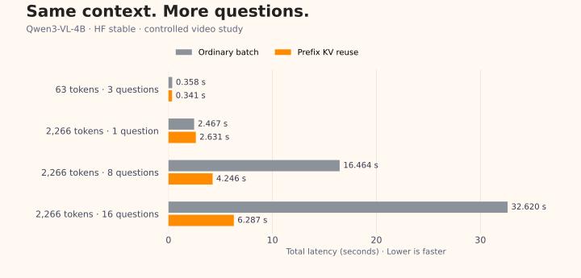

<p align="center">
  
</p>

<h1 align="center">mJev</h1>
<p align="center"><strong>简体中文</strong> · <a href="README.md">English</a></p>
<p align="center"><strong>Jev, with senses. mjev-doc, with documents.</strong></p>
<p align="center"><a href="#quick-start">🚀 快速开始</a> · <a href="https://huggingface.co/SoMarkAI/mJev-Qwen3-VL-4B-RLCD">🤗 mJev 权重</a> · <a href="#mjev-doc">📄 mjev-doc 模型说明</a></p>
<p align="center">
  <a href="LICENSE"></a>
  
  
</p>

## 超越文本的决策智能

给一张图、一份文档或一段视频，提出多个问题，为每题定义候选项。mJev 返回清晰的决策，以及每个候选的原始 logit 和概率，方便检查结果并接入后续流程。

mJev 将 Jev 工作流带入多模态场景，提供通用视觉与文档理解模型。多道题共享媒体上下文，每道题保留自己的候选集合。

- **一份上下文，多个决策**：复用前缀 KV，支持问题批处理。
- **候选由你定义**：候选数量可变，直接读取原生 LM Head 分数，返回结构化结果。
- **从 HF 开始**：无需安装 vLLM 或编译自定义 CUDA 内核，也可选择 vLLM 后端。

## 🧩 选择适合的模型

| 模型 | 适合的任务 | 从这里开始 |
| --- | --- | --- |
| **[mJev-Qwen3-VL-4B-RLCD](https://huggingface.co/SoMarkAI/mJev-Qwen3-VL-4B-RLCD)** | 通用图片与视频决策 | [模型权重](https://huggingface.co/SoMarkAI/mJev-Qwen3-VL-4B-RLCD) · [模型指南](docs/models.zh-CN.md) |
| **mjev-doc** | 文档类别、视觉属性、字段关系与明确规则下的业务决策 | [文档模型介绍](docs/docjev/README.zh-CN.md) · [真实示例](examples/docjev/README.md) |

两个模型均基于 Qwen3-VL-4B-Instruct，共享 HF 评分核心。需要音频或带音轨视频时，可使用官方 Qwen3-Omni Thinker 后端，沿用[同一套问题与候选接口](docs/hf.zh-CN.md)。

<a id="mjev-doc"></a>

### 📄 mjev-doc

一页文档，可以支持多个有价值的判断。mjev-doc 通过 RLCD 训练适配文档理解，冻结视觉参数、更新语言参数，[训练与评测](docs/docjev/results.md)统一维护在本项目。

模型权重将通过 **Hugging Face** 发布；当前 demo 支持完整本地 mjev-doc checkpoint，也可使用官方 Qwen3-VL 基础模型。

## 🎯 关键结果

| 模型 | 评测集 | 原始 Qwen | 训练后 | 提升 |
| --- | --- | ---: | ---: | ---: |
| mJev | [Compositional-VQA](https://huggingface.co/datasets/Immortal-Zhang/mJev-Compositional-VQA) · 195 道题 | 77.95% | **80.00%** | +2.05 个百分点 |
| mjev-doc | 文档诊断评测 · 1,512 道题 | 82.04% | **84.36%** | +2.31 个百分点 |

mJev 保留上游研究的 195 题评测结果。mjev-doc 的题目提供中英文版本，准确率按 3,024 条语言记录统计。两组使用各自的评测集，分数表示与参考答案的一致率。[mJev 训练](docs/training.zh-CN.md) · [mjev-doc 协议与完整结果](docs/docjev/results.md)

### ⚡ 上下文不换，问题接着来

同一视频、16 个问题，已有受控实验中，前缀 KV 复用将整组耗时从 **32.62 秒降到 6.29 秒，提速 5.19×**。

[](docs/cache_scaling.zh-CN.md)

实验使用官方 Qwen3-VL-4B、HF stable/causal 评分、2,266-token 公共前缀及单张 24 GB GPU。耗时包含媒体处理和首次 prefill，不计模型加载。[全部配置、显存与原始记录](docs/cache_scaling.zh-CN.md)

<a id="quick-start"></a>

## 🚀 快速开始

mJev 与 mjev-doc 共用 HF 推理核心，统一以**单张 24 GB NVIDIA GPU**为部署配置。需要 Linux、Python 3.11+ 和兼容的 NVIDIA 驱动；视频输入还需要系统 FFmpeg。

```bash
git clone https://gitlab.soulcode.cn/immortal/mjev.git
cd mjev
python3 -m venv .venv
source .venv/bin/activate
```

### 通用视觉 · mJev

```bash
python -m pip install torchcodec==0.11.0+cpu --index-url https://download.pytorch.org/whl/cpu
python -m pip install -e '.[hf-vl]' huggingface_hub

export MODEL_DIR="$HOME/models/mJev-Qwen3-VL-4B-RLCD"
hf download SoMarkAI/mJev-Qwen3-VL-4B-RLCD --local-dir "$MODEL_DIR"

CUDA_VISIBLE_DEVICES=0 python demo_hf.py --model "$MODEL_DIR" \
  --input examples/multiple.json --mode causal --numerics stable --projection full \
  --prefix-cache --question-batch-size 2 --output outputs/image-demo.json
```

### 文档理解 · mjev-doc

指定完整的 mjev-doc checkpoint 目录：

```bash
python -m pip install -e '.[docjev]'
CUDA_VISIBLE_DEVICES=0 python demo_docjev.py --model /path/to/mjev-doc \
  --input examples/docjev/multiple.json --device-map cuda:0 \
  --output outputs/document-demo.json
```

🎉 结果保存在 `outputs/`。通用图片示例采用 stable 数值配置并复用前缀；文档示例采用 native BF16。文档缓存模式可添加 `--numerics stable --prefix-cache --question-batch-size 2`。[更多示例](examples/README.zh-CN.md) · [HF 部署](docs/hf.zh-CN.md) · [vLLM 部署](docs/vllm.zh-CN.md)

## 📝 使用自己的问题

一份媒体、公共上下文和一组问题：

```json
{
  "image": "rectangle.png",
  "context": "Inspect the supplied picture.",
  "questions": [
    {"question": "What color is the rectangle?", "candidates": ["Red", "Blue", "Green"]},
    {"question": "Which shape is shown?", "candidates": ["Rectangle", "Circle"]}
  ]
}
```

媒体路径相对于输入 JSON 文件解析。每题输出包含 `candidates`、`decision` 和 `probability_sum`。可浏览[运行输入与已有输出](examples/README.zh-CN.md)，其中也包含[真实文档与中英文问题](examples/docjev/README.md)。

候选概率由标签 logits 在本题候选集合内做 softmax 得到，决策选择最高原始 logit。概率表示候选之间的相对偏好，不是校准后的置信度；标签会在实际模板下通过单 token 校验。[文档输入输出](docs/docjev/input-output.md) · [音视频输入](docs/hf.zh-CN.md#demo)

## 🔎 工作方式

```text
媒体 + 公共上下文 → 官方 processor 与 chat template → 公共前缀
                                                    ├─ 问题 1 + candidates → Answer logits
                                                    ├─ 问题 2 + candidates → Answer logits
                                                    └─ 问题 N + candidates → Answer logits
候选标签 logits → 候选集合内 softmax → 决策
```

分数来自模型原有 LM Head：HF 直接调用 forward，vLLM 使用 pooling。默认采用普通 causal attention；候选隔离模式可显式启用，用于受控实验。[架构与缓存](docs/docjev/architecture.md) · [实现指南](docs/development.zh-CN.md)

## 📚 继续探索

| 你想做什么 | 去这里 |
| --- | --- |
| 部署、选模型 | [模型指南](docs/models.zh-CN.md) · [HF](docs/hf.zh-CN.md) · [vLLM](docs/vllm.zh-CN.md) |
| 训练或评测文档模型 | [mjev-doc](docs/docjev/README.zh-CN.md) · [训练](docs/docjev/training.md) · [结果](docs/docjev/results.md) |
| 准备数据、复现评测 | [Benchmark](docs/benchmark.zh-CN.md) · [公开小型评测](docs/reproduce.zh-CN.md) |
| 阅读代码、运行测试 | [开发者指南](docs/development.zh-CN.md) · [测试](docs/testing.zh-CN.md) |
| 查看性能与验证证据 | [缓存性能](docs/cache_scaling.zh-CN.md) · [最新验证](docs/validation_current.zh-CN.md) |

数值配置与实验后端等内容见[完整文档](docs/index.zh-CN.md)。

## 🤝 贡献与交流

欢迎提交 bug、使用示例和改进建议。[提 Issue](https://gitlab.soulcode.cn/immortal/mjev/-/issues) · [提交合并请求](https://gitlab.soulcode.cn/immortal/mjev/-/merge_requests) · [贡献指南](CONTRIBUTING.zh-CN.md)

感谢 [Immortal-Zhang](https://github.com/Immortal-Zhang)、[Kyousuke661](https://github.com/Kyousuke661) 和 [BinyangQiu](https://github.com/BinyangQiu)。

## 📜 许可证

代码采用 [Apache-2.0](LICENSE)，署名见 [NOTICE](NOTICE)。模型权重与第三方数据保留各自许可证，文档示例保留 CC-BY-2.0 署名；详见[第三方许可](THIRD_PARTY_LICENSES.zh-CN.md)。
