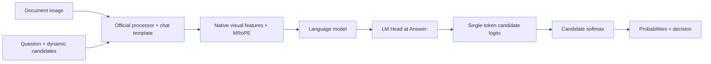

# Architecture

[Project](../../README.md)

## A bounded decision space

Labels A, B, C… are encoded after the complete rendered `Answer:\n` prefix. The builder checks that appending each label adds exactly one distinct token and leaves the existing prefix unchanged. Candidate spans are tracked through official image-token expansion.

The model performs a forward pass. Only the last position is projected by its unchanged LM Head, then the label logits are gathered. There is no generated completion, answer parser, trained decision head or vocabulary-wide sampling. The public API always uses `projection='full'` to preserve the training readout's numerical behavior.

## Attention

**Causal** is the default. Each position sees earlier tokens. Later candidates can see earlier candidates; the final answer position sees every candidate.

**Isolated** additionally blocks candidate-to-other-candidate visibility. Each candidate sees the common context/question and its own preceding tokens. The answer suffix sees all candidates. The mask is inserted after native MRoPE construction and removed after the scoring call, including on exceptions. No model weights change when selecting this mode.

Isolation is a controlled inference experiment, not a guaranteed accuracy improvement. The first mJev-Doc training study used causal attention throughout.

## Multiple questions and cache

Question-dependent tokens never enter the reusable prefix. The official image processing and common context are prefetched once; each question receives a cloned KV branch. Real batches combine independent questions into one model forward. Right padding is masked and the last real position is scored. Native per-question positions are retained.

The branch copy avoids cross-question contamination but duplicates cache storage; it is not zero-copy Tree-KV or a server-wide cache. The HF backend serializes access around model hooks and numerical state. Batch size means questions in one forward, not independent HTTP requests or Python worker threads.

## Numerical profiles

- `native`: BF16 parameters and native SDPA, matching the first training/evaluation study. Default batch size 1, no prefix caching.
- `stable`: FP32 text computation and aligned attention for comparing batch/cache paths. Model weight files remain unchanged; temporary computation settings are scoped and restored.

Stable results can differ from native BF16. Never compare a cached stable output to an uncached native result as if they were one execution protocol. CLI cache/batch paths require stable numerics.

## Code map

| Location | Responsibility |
| :--- | :--- |
| `docjev/engine.py` | Document-only API, training-compatible RGB processing and limits |
| `docjev/io.py` | Public JSON/Jev schema and local media resolution |
| `docjev/metrics.py` | Accuracy, score validation, semantic consistency |
| `docjev/evaluate.py` | Label-free model requests, candidate permutations and reporting |
| `docjev/rlcd/` | Frozen reference scoring, objective, FSDP, export/resume |
| `mjev/` | Shared native HF runtime, processor, attention and caching |

Processor pixel limits default to 3,136–501,760. The full processed input limit is 4,000 tokens and never silently truncates.
