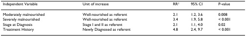

# A real validation document

[Project](../../README.md)



One research table, four questions, two languages. This is an actual held-out Infinity validation image with **four aligned Chinese/English question pairs** and **4, 3, 3 and 2 candidates**. Questions, candidate order and reference labels are copied unchanged from the frozen validation records; the JPEG is byte-identical to the validation image.

| File | Purpose |
| :--- | :--- |
| `single.json` | One original English question, four candidates |
| `multiple.json` | All eight original language records for this image |
| `metadata.json` | Sample identifiers, media attribution, hashes and scoring setup |
| `recorded-output.json` | Actual trained-model native BF16 output |

```bash
python demo_docjev.py --model models/Qwen3-VL-4B-Instruct --input examples/docjev/single.json
python demo_docjev.py --model models/Qwen3-VL-4B-Instruct --input examples/docjev/multiple.json
python demo_docjev.py --model models/Qwen3-VL-4B-Instruct --input examples/docjev/multiple.json \
  --numerics stable --prefix-cache --question-batch-size 2
```

The commands use official pretrained weights. The recorded output uses **mJev-Doc**, so scores can differ. To reproduce it, pass your local trained `checkpoint-final` to `--model`. No checkpoint is bundled or publicly hosted by this repository.

Reference labels are ignored by inference. These annotations are the existing model-generated, screened validation references, not official human-authored Infinity QA annotations. The recorded run matches the reference labels on 6 of 8 language records; both mismatches are retained. One table demonstrates the API; its result is not the full validation accuracy. Keep this held-out example out of training.

## Media attribution

Table 3 from Digant Gupta, Carolyn A Lammersfeld, Pankaj G Vashi, Sadie L Dahlk and Christopher G Lis, *Can subjective global assessment of nutritional status predict survival in ovarian cancer?*, **Journal of Ovarian Research 1, 5 (2008)**. © 2008 Gupta et al.; licensee BioMed Central Ltd.

[Original article](https://link.springer.com/article/10.1186/1757-2215-1-5) · [CC BY 2.0](https://creativecommons.org/licenses/by/2.0/)

The document image is a table crop supplied by Infinity. We retain those image bytes unchanged; the cover scales this same crop for display. The source table and its appearance in the cover retain CC BY 2.0, separately from the Apache-2.0 code license.
